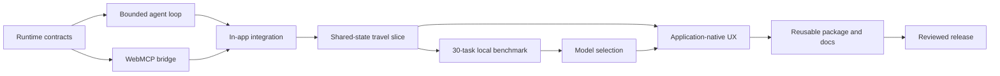

# Agent-Native Runtime: Solo Work Split

**Owner:** Gnanasekaran

**Execution model:** one maintainer, one active feature branch, one reviewed pull request at a time

**Product:** Latchwork — an agent-native runtime and reference application for WebMCP

## Project goal

Build a reusable TypeScript runtime that lets a WebMCP application define its semantic capabilities once and use that same tool surface in two places:

1. external WebMCP agents; and
2. a first-class collaborative agent inside the application.

The showcase must prove multi-step tool use, intermediate-result reuse, live shared-state collaboration, human approval for changes, backend interchangeability, and a capable browser-local model. The application—not a chat transcript—must remain the visible output.

This direction follows the final strategic revision and priority order in **WebMCP Agent-Native Runtime Winning PRD v3**, especially §§49–58 (pages 15–19). Earlier chatbot-style and one-shot reference concepts are superseded by that revision.

## Solo roles and ownership

Gnanasekaran owns every role, but works through them as separate pull-request-sized workstreams. A workstream hands off only through the shared interfaces below.

| Workstream | Primary ownership | Deliverable boundary |
| --- | --- | --- |
| Runtime Core | agent loop, tool refresh, history, validation, policy, approval, events, stop conditions | reusable runtime modules and unit tests; no showcase-specific UI logic |
| WebMCP Bridge | one canonical tool definition used for browser registration and in-app execution | adapters and integration tests; no duplicated tool schemas |
| Models and Evaluation | local/cloud model adapters, prompts, retrieval, benchmark harness, measured results | model-neutral adapter contract and evidence; no runtime policy bypass |
| Reference App | travel state, 8–12 WebMCP tools, human edits, application-native agent UX | deterministic showcase data and UI; no private runtime fork |
| Release and Review | branch hygiene, local verification, code review, CI, documentation, merge decision | evidence-backed PR; no unreviewed direct push to `main` |

## Ownership boundaries

- Runtime Core decides how a run progresses, validates calls, enforces step limits, emits events, and pauses unsafe mutations.
- The WebMCP Bridge owns translation only. It must not contain product planning rules or model-specific prompts.
- Model adapters convert the runtime request into backend inference. They must not execute tools or mutate application state.
- The reference app owns domain state and deterministic tool behavior. It must consume the shared runtime rather than copy it.
- The visible application owns final human confirmation. Booking, payment, account, and irreversible actions remain outside the autonomous tool surface.

## Shared interfaces

These contracts are the handoff points between workstreams:

| Interface | Purpose |
| --- | --- |
| `RuntimeTool` | canonical name, description, JSON input schema, risk annotation, and executor |
| `RuntimeModel` | model-neutral structured generation request |
| `AgentRunOptions` | goal, dynamic tool provider, model, step limit, cancellation, approval, and event sink |
| `AgentDecision` | closed union of one tool call or a final message |
| `AgentEvent` | trace events for tool refresh, validation, approval, execution, failure, and completion |
| `AgentRunResult` | completed, approval-required, denied, ambiguous-write-failure, or step-limit outcome plus trace and history |
| application state revision | rejects stale model results after a human edits shared state |

The PRD requires model-agnostic backends and the same WebMCP surface inside and outside the app (§§49–50, 53, 55). These interfaces keep that boundary explicit.

## Day-by-day plan

### Day 1 — Runtime foundation

- Add canonical runtime/tool/model/result interfaces.
- Implement a bounded multi-step loop that refreshes tools before every model step.
- Validate model decisions and tool input before execution.
- Feed serialized tool results and failures back into later model steps.
- Pause non-read-only calls unless an explicit approval handler approves them.
- Add unit tests for multi-step calls, dynamic tools, invalid inputs, approval, failures, and step limits.
- Preserve the current Latchwork UI and WebMCP registration behavior.

**PR:** `feat/agent-runtime-foundation`

### Day 2 — Shared WebMCP bridge

- Connect the current in-app agent to the shared runtime.
- Make `createLatchworkTools()` the single source used by both `document.modelContext.registerTool()` and the in-app runtime.
- Add event trace plumbing and cancellation.
- Preserve human-only final application and stale-state rejection.
- Add integration tests proving the same tool definitions serve both paths.

### Day 3 — Collaborative vertical slice

- Add a deterministic travel-domain state fixture without polishing the complete UI.
- Implement the first 6–8 read/stage tools, including constraints, search, itinerary reads, and reviewable itinerary changes.
- Prove one 2–6 call hero workflow: Japan trip under ₹1.5L, keep Tokyo and Kyoto, avoid red-eyes, do not book.
- Let the human alter the same state, then rerun against the latest WebMCP state and repair the plan.
- Show compact, entity-referenced trace and inline approval for staged changes.

### Day 4 — Local-model go/no-go benchmark

- Expand to at least 30 deterministic tasks across simple selection, intermediate IDs, multi-step state changes, recovery, and confirmation boundaries.
- Benchmark two target local model sizes plus one independent small baseline.
- Measure full-task success, schema-valid rate, identifier reuse, state recovery, latency, and memory.
- Record failure categories and decide the showcased local workflow from evidence.
- Keep explicit local/cloud selection; automatic routing remains optional.

### Day 5 — Reference app and UI primitives

- Complete the 8–12 tool travel surface.
- Make the application state—not chat bubbles—the primary output.
- Add goal input, live action trace, inline confirmations, app-native highlights, undo where supported, and backend indicator.
- Polish the 3-minute collaboration demo and responsive/accessibility behavior.

### Day 6+ — Packaging, proof, and release

- Extract the stable runtime surface into a reusable package only after the app integration proves it.
- Add a second thin integration fixture to prove the runtime is not travel-specific.
- Add cloud adapter parity without changing runtime policy semantics.
- Publish integration documentation, architecture diagram, benchmark evidence, limitations, and demo script.
- Run full local verification, adversarial review, CI, and merge through a pull request.
- Deploy publicly only after a separate explicit release approval.

## Git branch strategy

- Branch from an up-to-date, clean `main`.
- Use one focused branch per milestone: `feat/<slice>`, `fix/<defect>`, or `docs/<topic>`.
- Keep only one active implementation PR to reduce solo context switching and stacked-change risk.
- Every PR must include tests for behavior it adds or changes.
- Before merge: run the complete local verification gate, self-review the final diff, fix findings, push, wait for CI, and review the exact head commit.
- Merge only after the PR is green and the user explicitly requests merge.
- Never commit directly to `main`; never combine public deployment with a feature PR.

## Critical milestones

| Milestone | Proof required |
| --- | --- |
| M1 — Reusable loop | dynamic tools, 2+ calls, intermediate results, validation, approval, trace, and bounded termination pass tests |
| M2 — Same surface | one tool definition is demonstrably registered for external WebMCP and consumed in-app |
| M3 — Shared-state recovery | a human edit changes application state and the next agent run adapts without stale overwrite |
| M4 — Local proof | selected local model completes a constrained impressive workflow with published measurements |
| M5 — Winning showcase | polished live app, clear 3-minute collaboration sequence, no booking, reusable runtime story |
| M6 — Release readiness | complete docs, full verification, green CI, reviewed PR, explicit deployment approval |

## Dependency graph

## What to avoid modifying

| Active workstream | Avoid modifying |
| --- | --- |
| Runtime Core | current board layout, global styling, travel domain content, hosting configuration |
| WebMCP Bridge | model weights, benchmark scoring, app visuals, domain policy |
| Models and Evaluation | tool executors, approval semantics, application state directly |
| Reference App | runtime contracts, model adapter internals, CI/release policy |
| Release and Review | product behavior except narrow fixes demonstrated during review |

Across all workstreams, avoid exposing booking, payment, credential, deletion, or irreversible actions as automatically executable tools. Do not invent browser WebMCP discovery APIs; use verified platform capabilities and an app-owned shared tool provider until a standard discovery surface is confirmed.

## If a day finishes early

- Add adversarial tests for duplicate tools, stale state, cancellation, malformed output, oversized results, execution failure, and unsupported schemas.
- Reduce prompt/tool payload size and measure the change.
- Improve trace readability without changing runtime behavior.
- Add deterministic benchmark cases before adding model-specific prompt tricks.
- Improve README integration examples and explicit implemented-versus-planned boundaries.
- Review the next PR plan and predefine its acceptance tests.

Do not use spare time for automatic model routing, extra showcase apps, a large integration catalog, or public deployment until the critical milestones pass. This follows the PRD priority order in §56 (page 19).

## Definition of success by Day 3

Day 3 succeeds only when all of the following are demonstrated:

- the runtime refreshes and consumes the current tool surface through shared interfaces;
- one goal completes through 2–6 validated tool calls using at least one intermediate identifier;
- non-read-only actions pause for visible approval and no booking capability exists;
- the user can edit the same application state while collaborating;
- the next agent run reads the new state and adapts without applying a stale result;
- the trace identifies the current action and affected entity;
- deterministic tests cover validation, step limits, failures, approval, and shared-state recovery;
- the complete local verification gate passes through a reviewed PR;
- the current UI remains usable while the broader travel showcase is still in progress.

This implements the collaboration-first quality gates in PRD v3 §§51–57 (pages 16–19) before visual polish or optional routing work.

## Source references

- **WebMCP Agent-Native Runtime Winning PRD v3**, §§49–50: agent-native runtime positioning and model-backend architecture.
- **WebMCP Agent-Native Runtime Winning PRD v3**, §§51–53: collaboration showcase, hero sequence, and UI primitives.
- **WebMCP Agent-Native Runtime Winning PRD v3**, §§54–55: evaluation framework and competitive quality gates.
- **WebMCP Agent-Native Runtime Winning PRD v3**, §§56–58: execution priority, final architecture, positioning, and tagline.
