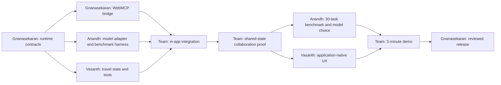

# Agent-Native Runtime: Team Work Split

**Team:** Gnanasekaran, Anandh, Vasanth

**Execution model:** three parallel owners, explicit file boundaries, one reviewed pull request per coherent change

**Product:** Latchwork — an agent-native runtime and reference application for WebMCP

## Project goal

Build a reusable TypeScript runtime that lets a WebMCP application define its semantic capabilities once and use that same tool surface in two places:

1. external WebMCP agents; and
2. a first-class collaborative agent inside the application.

The showcase must prove multi-step tool use, intermediate-result reuse, live shared-state collaboration, human approval for changes, backend interchangeability, and a capable browser-local model. The application—not a chat transcript—must remain the visible output.

This direction follows the final strategic revision and priority order in **WebMCP Agent-Native Runtime Winning PRD v3**, especially §§49–58 (pages 15–19). Earlier chatbot-style and one-shot reference concepts are superseded by that revision.

## Team roles and ownership

Each person owns one primary layer and hands work to the others only through the shared interfaces below. Gnanasekaran owns final integration and release coordination, but every author remains responsible for tests and self-review in their own pull request.

| Person | Primary ownership | Secondary ownership | Planned code surface |
| --- | --- | --- | --- |
| **Gnanasekaran** | Runtime Core, WebMCP bridge, safety/policy, final integration | architecture, release coordination, cross-layer review | `lib/agent-runtime*`, `lib/webmcp*`, runtime integration modules |
| **Anandh** | local model adapters, prompting, tool retrieval, benchmark harness and results | model selection, latency/memory measurement, failure analysis | model adapter modules, `benchmarks/`, benchmark documentation |
| **Vasanth** | collaborative travel reference app, WebMCP domain tools, UI/UX | accessibility, responsive polish, deployment readiness and demo assets | `app/`, travel-domain modules, UI tests and deployment documentation |

## Ownership boundaries

- **Gnanasekaran** decides how a run progresses, validates calls, enforces step limits, emits events, pauses unsafe mutations, and exposes the canonical WebMCP bridge. Runtime code must not contain travel-specific UI or model-specific tuning.
- **Anandh** converts runtime requests into local or cloud inference, ranks the available tools, maintains deterministic evaluation tasks, and publishes measured results. Model code must not execute tools, weaken policy, or mutate application state.
- **Vasanth** owns travel state, deterministic inventory, domain tool executors, human-edit interactions, and the application-native experience. The reference app must consume the shared runtime rather than copy or fork it.
- **Gnanasekaran and Vasanth** jointly verify the visible approval boundary. Booking, payment, account, credential, deletion, and irreversible actions remain outside autonomous execution.
- Shared files such as `README.md`, package manifests, CI, and hosting configuration require coordination before modification.

## Shared interfaces

These contracts are the handoff points between workstreams:

| Interface | Owner | Consumers | Purpose |
| --- | --- | --- | --- |
| `RuntimeTool` | Gnanasekaran | Anandh, Vasanth | canonical name, description, JSON input schema, risk annotation, and executor |
| `RuntimeModel` | Gnanasekaran defines; Anandh implements | runtime | model-neutral structured generation request |
| `AgentRunOptions` | Gnanasekaran | Anandh, Vasanth | goal, dynamic tool provider, model, step limit, cancellation, approval, and event sink |
| `AgentDecision` | Gnanasekaran | Anandh | closed union of one tool call or a final message |
| `AgentEvent` | Gnanasekaran | Vasanth | trace events for tool refresh, validation, approval, execution, failure, and completion |
| `AgentRunResult` | Gnanasekaran | Vasanth | completed, approval-required, denied, ambiguous-write-failure, or step-limit outcome plus trace and history |
| travel state revision | Vasanth defines; Gnanasekaran enforces | runtime and UI | rejects stale model results after a human edits shared state |
| benchmark task/result schema | Anandh | all three | comparable task success, identifier reuse, recovery, latency, and memory evidence |

The PRD requires model-agnostic backends and the same WebMCP surface inside and outside the app (§§49–50, 53, 55). These interfaces keep that boundary explicit.

## Day-by-day plan

### Day 1 — Runtime foundation

- **Gnanasekaran:** finish the canonical runtime/tool/model/result interfaces, bounded multi-step loop, validation, approval, failure handling, event trace, tests, and PR #7 review cycle.
- **Anandh:** define the benchmark task/result format, failure taxonomy, candidate local-model matrix, and the first 10 smoke tasks without changing runtime code.
- **Vasanth:** define deterministic Japan travel inventory, travel state entities, proposed 8–12 tool names/schemas, and the collaboration UI flow without changing the current app implementation.
- **Team checkpoint:** review the shared contracts together; freeze interface names required for Day 2.

- **Runtime PR:** `feat/agent-runtime-foundation`
- **Anandh branch:** `feat/model-benchmark-foundation` after the runtime contract lands
- **Vasanth branch:** `feat/travel-domain-foundation` after the runtime contract lands

### Day 2 — Shared WebMCP bridge

- **Gnanasekaran:** connect the in-app agent to the shared runtime; make one tool definition serve WebMCP registration and in-app execution; add cancellation and integration tests.
- **Anandh:** implement the first `RuntimeModel` local adapter, structured decision prompt, tool-retrieval baseline, and benchmark runner using deterministic fake-model tests.
- **Vasanth:** implement typed travel state plus 6–8 read/stage tools against deterministic inventory; add tool behavior and schema tests without broad UI polish.
- **Team checkpoint:** prove the same travel tool definition can be registered externally and consumed by the in-app runtime.

### Day 3 — Collaborative vertical slice

- **Gnanasekaran:** integrate runtime, model adapter, travel tools, approval gate, and stale-state protection; own the end-to-end regression tests.
- **Anandh:** tune only through measured prompt/retrieval changes; make the hero workflow reliably reuse intermediate IDs over 2–6 calls; publish the Day 3 smoke results.
- **Vasanth:** deliver the smallest working travel UI slice with goal input, itinerary/budget state, compact entity-referenced trace, inline staged-change approval, and one manual state edit.
- **Team checkpoint:** run the Japan hero workflow, manually remove or move an itinerary item, and prove the next agent run reads and repairs the latest state without booking anything.

### Day 4 — Local-model go/no-go benchmark

- **Anandh (lead):** expand to at least 30 deterministic tasks; benchmark two target local model sizes plus one independent baseline; measure full-task success, schema validity, identifier reuse, recovery, latency, and memory.
- **Gnanasekaran:** verify failures are model/retrieval failures rather than runtime or policy defects; fix only demonstrated runtime issues through a separate PR.
- **Vasanth:** validate that benchmark tasks reflect real visible application states and keep UI trace labels aligned with runtime entities.
- **Team decision:** select the local showcase workflow from evidence; retain explicit local/cloud selection and defer automatic routing.

### Day 5 — Reference app and UI primitives

- **Vasanth (lead):** complete the 8–12 tool travel surface and application-native UI; add live trace, inline confirmations, highlights, undo where supported, backend indicator, responsive behavior, and accessibility.
- **Anandh:** finalize model progress/error states and provide measured copy for local-model limitations without inventing performance claims.
- **Gnanasekaran:** review runtime boundaries, stale-state recovery, approval behavior, and external/in-app WebMCP parity; integrate only after both owner PRs pass review.
- **Team checkpoint:** rehearse the complete 3-minute collaboration demo with the application—not chat—as the output.

### Day 6+ — Packaging, proof, and release

- **Gnanasekaran:** extract the proven runtime surface into a reusable package, add a second thin integration fixture, complete architecture/integration docs, and coordinate release review.
- **Anandh:** add cloud adapter parity without changing runtime policy semantics; publish benchmark evidence, model limitations, and reproducible commands.
- **Vasanth:** finalize the live-site experience, demo assets, responsive/accessibility checks, deployment checklist, and rollback-ready release notes.
- **Every author:** run full local verification, self-review the exact diff, obtain at least one non-author review, fix findings, and wait for CI.
- **Release rule:** public deployment happens only after a separate explicit approval from Gnanasekaran/user.

## Git branch strategy

- Branch from an up-to-date, clean `main` after prerequisite PRs merge; do not stack unreviewed feature branches unless the team explicitly records the dependency.
- Use owner-specific focused names: `feat/runtime-*` for Gnanasekaran, `feat/model-*` or `bench/*` for Anandh, and `feat/travel-*` or `feat/ui-*` for Vasanth.
- Each person works in their own checkout/branch. Never share one working tree or push commits into another person's branch without coordination.
- Keep each PR inside the ownership table. Shared-file edits must be declared in the PR description to prevent silent conflicts.
- Every behavioral PR includes tests. Documentation-only planning PRs run formatting/link checks appropriate to their scope.
- Before merge, the author runs the complete local verification gate and self-review; at least one non-author reviews the exact head commit.
- **Review matrix:** Gnanasekaran reviews model and UI safety/integration; Anandh reviews model contracts, prompts, retrieval, and benchmark claims; Vasanth reviews visible workflow, trace clarity, accessibility, and demo behavior.
- Gnanasekaran performs final integration review, but an author cannot count their own approval as the required non-author review.
- Merge only after findings are resolved, CI is green, head SHA is unchanged since approval, and the user explicitly requests merge.
- Never commit directly to `main`; never combine public deployment with a feature PR.

## Critical milestones

| Milestone | Owner | Dependency | Proof required |
| --- | --- | --- | --- |
| M1 — Reusable loop | Gnanasekaran | none | dynamic tools, 2+ calls, intermediate results, validation, approval, trace, and bounded termination pass tests |
| M2 — Same surface | Gnanasekaran | M1 | one tool definition is demonstrably registered for external WebMCP and consumed in-app |
| M3 — Travel tool surface | Vasanth | M1 contracts | deterministic state plus 6–8 tested read/stage tools with no booking capability |
| M4 — Model and benchmark harness | Anandh | M1 contracts | runtime adapter, retrieval baseline, reproducible tasks, metrics, and failure taxonomy |
| M5 — Shared-state recovery | Gnanasekaran + Vasanth | M2, M3, M4 smoke pass | a human edit changes state and the next agent run adapts without stale overwrite |
| M6 — Local proof | Anandh | M5 | selected local model completes the constrained workflow with published measurements |
| M7 — Winning showcase | Vasanth + team | M5, M6 | polished live app, clear 3-minute collaboration sequence, no booking, reusable runtime story |
| M8 — Release readiness | Gnanasekaran + team | M7 | complete docs, full verification, non-author reviews, green CI, explicit deployment approval |

## Dependency graph

## What to avoid modifying

| Person | Avoid modifying without coordination |
| --- | --- |
| **Gnanasekaran** | app layout/global styling, travel inventory/content, model prompts, benchmark scoring and reported model results |
| **Anandh** | runtime loop/policy, WebMCP executors, approval semantics, application state, UI styling, hosting configuration |
| **Vasanth** | runtime contracts, model adapter internals, prompt/retrieval logic, benchmark scoring, CI/release policy |

No one should independently change `package.json`, `package-lock.json`, `README.md`, CI, hosting configuration, or shared public interfaces while another open PR also touches them. Coordinate the owner and merge order first.

Across all workstreams, avoid exposing booking, payment, credential, deletion, or irreversible actions as automatically executable tools. Do not invent browser WebMCP discovery APIs; use verified platform capabilities and an app-owned shared tool provider until a standard discovery surface is confirmed.

## If someone finishes early

- **Gnanasekaran:** add adversarial runtime tests for duplicate tools, stale state, cancellation, malformed output, oversized results, execution failure, and unsupported schemas; review Anandh/Vasanth contracts.
- **Anandh:** add deterministic benchmark cases, failure labels, result reports, and prompt-size measurements before model-specific tricks.
- **Vasanth:** add accessibility cases, empty/error/loading states, keyboard/touch behavior, trace readability, and demo-script polish without changing runtime behavior.
- **Any teammate:** review another person's open PR, predefine the next acceptance tests, or improve implemented-versus-planned documentation inside their ownership boundary.

Do not use spare time for automatic model routing, extra showcase apps, a large integration catalog, or public deployment until the critical milestones pass. This follows the PRD priority order in §56 (page 19).

## Definition of success by Day 3

Day 3 succeeds only when all of the following are demonstrated:

- Gnanasekaran's bounded runtime and shared WebMCP bridge are merged and consumed by the integration slice;
- Anandh's model adapter and smoke benchmark can reproduce and score the hero flow;
- Vasanth's deterministic travel state/tools and smallest collaborative UI slice are working;
- the runtime refreshes and consumes the current tool surface through shared interfaces;
- one goal completes through 2–6 validated tool calls using at least one intermediate identifier;
- non-read-only actions pause for visible approval and no booking capability exists;
- the user can edit the same application state while collaborating;
- the next agent run reads the new state and adapts without applying a stale result;
- the trace identifies the current action and affected entity;
- deterministic tests cover validation, step limits, failures, approval, and shared-state recovery;
- every merged Day 1–3 PR passes the complete local verification gate and has a non-author review;
- the current UI remains usable while the broader travel showcase is still in progress.

This implements the collaboration-first quality gates in PRD v3 §§51–57 (pages 16–19) before visual polish or optional routing work.

## Source references

- **WebMCP Agent-Native Runtime Winning PRD v3**, §§49–50: agent-native runtime positioning and model-backend architecture.
- **WebMCP Agent-Native Runtime Winning PRD v3**, §§51–53: collaboration showcase, hero sequence, and UI primitives.
- **WebMCP Agent-Native Runtime Winning PRD v3**, §§54–55: evaluation framework and competitive quality gates.
- **WebMCP Agent-Native Runtime Winning PRD v3**, §§56–58: execution priority, final architecture, positioning, and tagline.
